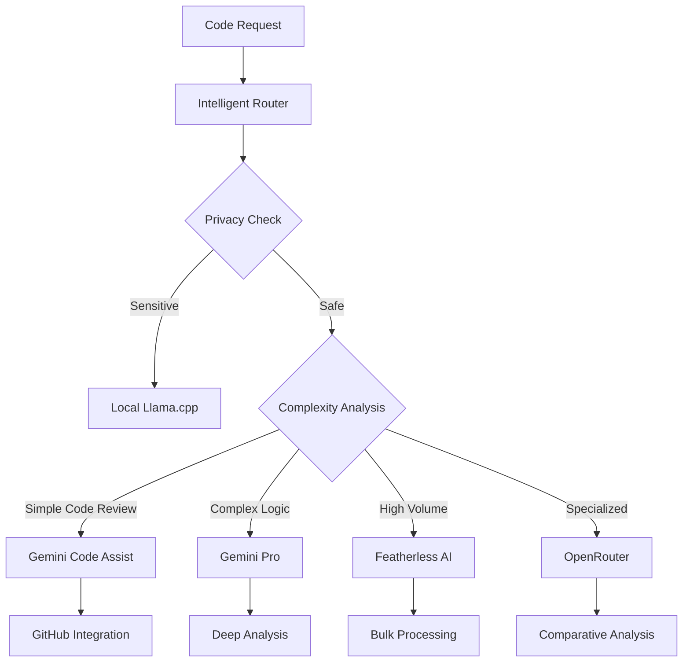
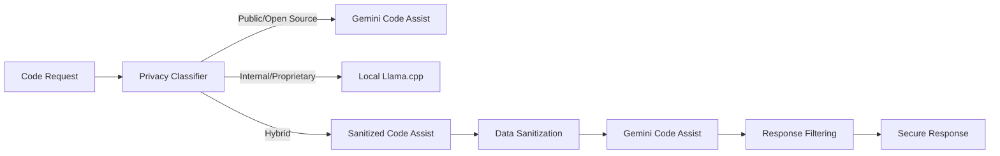

# Gemini Code Assist Synergy Enhancement Proposal
## Integrating Code Assist with dy-swarm's Intelligent Resource Routing Architecture

### Executive Summary

This proposal outlines strategic enhancements to integrate Google's Gemini Code Assist with the dy-swarm ecosystem's intelligent resource routing architecture. By leveraging existing Gemini Pro integration patterns and extending the intelligent router capabilities, we can create unprecedented synergy between automated code assistance and intelligent resource allocation.

### Current dy-swarm Architecture Overview

The dy-swarm operates on an **Intelligent Resource Routing** principle with the following key components:

#### Asset Roster and Primary Roles
- **Linear (Business Plan)**: Central Project Management & Automation Hub
- **Local Llama.cpp (On-Premise)**: Private Logic & Security Analyst
- **Gemini Pro (via CLI / Code Assist)**: Primary High-Reasoning Engine
- **Featherless AI (Fixed-Cost Plan)**: High-Volume Data Intake & Standard RAG Workhorse
- **OpenRouter (Free Tier)**: Flexible Specialist & Comparative Analyst

#### Key Workflows
1. **"Idea to Done" Pipeline**: Slack → Linear → CodeGen → GitHub → Knowledge Graph
2. **"Intelligent RAG" Pipeline**: Query → Router Analysis → Appropriate Resource → Response

### Synergy Enhancement Opportunities

#### 1. Enhanced Intelligent Router for Code Assist Integration

**Current State**: Router directs tasks based on privacy, intent, and resource cost
**Enhancement**: Extend router to handle Code Assist routing decisions



**Implementation Strategy**:
- Context-aware Code Assist feature selection
- Dynamic routing based on project type, complexity, and privacy requirements
- Integration with existing privacy gateway (Local Llama.cpp)
- Performance metrics and cost optimization

#### 2. Automated Pipeline Enhancement with Code Assist

**Idea to Done Pipeline Enhancement**:
```
Intake → Triage → Decomposition → Execution + Code Assist → Technical Summary → Status Update
```

**New Integration Points**:
- **Pre-execution**: Code Assist reviews task requirements and suggests implementation approaches
- **During execution**: Real-time code suggestions and quality checks
- **Post-execution**: Automated PR reviews and improvement suggestions
- **Knowledge capture**: Enhanced technical summaries with Code Assist insights

**Intelligent RAG Pipeline Enhancement**:
```
Query → Router → Code Assist Integration → Enhanced Response
```

**New Capabilities**:
- Code-related queries automatically routed to Code Assist
- Enhanced code example generation
- Automated documentation updates
- Context-aware code suggestions in RAG responses

#### 3. Privacy-Aware Code Assistance

**Challenge**: Maintaining privacy compliance while leveraging Code Assist
**Solution**: Multi-tier privacy filtering



**Implementation**:
- Automated code classification (public vs. proprietary)
- Data sanitization for hybrid scenarios
- Response filtering and validation
- Audit trails for compliance

#### 4. Cost-Optimized Resource Allocation

**Current Goal**: Maximize capability while minimizing variable pay-per-token costs
**Enhancement**: Intelligent Code Assist usage optimization

**Optimization Strategies**:
- **Batch Processing**: Group similar code review requests
- **Caching**: Store and reuse Code Assist responses for similar patterns
- **Progressive Enhancement**: Start with basic checks, escalate to complex analysis only when needed
- **Load Balancing**: Distribute requests across available resources

#### 5. Enhanced GitHub Integration

**Current Integration**: Basic GitHub operations
**Enhanced Integration**: Deep Code Assist integration

**New Capabilities**:
- Automated PR creation with Code Assist pre-review
- Smart commit message generation
- Intelligent merge conflict resolution
- Automated code quality gates
- Enhanced technical documentation generation

### Technical Implementation Plan

#### Phase 1: Router Enhancement (DY-32)
1. Extend intelligent router with Code Assist routing logic
2. Implement context detection for code-related requests
3. Create routing rules for different Code Assist features
4. Add performance monitoring and cost tracking

#### Phase 2: Pipeline Integration (DY-33)
1. Modify "Idea to Done" pipeline for Code Assist integration
2. Enhance "Intelligent RAG" pipeline with code assistance
3. Implement automated quality gates
4. Add metrics and monitoring

#### Phase 3: Privacy and Security
1. Implement privacy classification system
2. Create data sanitization mechanisms
3. Add audit trails and compliance monitoring
4. Test with sensitive code scenarios

#### Phase 4: Optimization and Scaling
1. Implement cost optimization strategies
2. Add caching and batch processing
3. Create load balancing mechanisms
4. Performance tuning and monitoring

### Expected Benefits

#### Immediate Benefits
- **Improved Code Quality**: Automated reviews catch issues early
- **Faster Development Cycles**: Intelligent assistance reduces manual effort
- **Enhanced Knowledge Base**: Better code examples and documentation
- **Reduced Manual Review Overhead**: Automated first-pass reviews

#### Long-term Benefits
- **Cost Optimization**: Intelligent routing minimizes expensive API calls
- **Privacy Compliance**: Secure handling of sensitive code
- **Scalable Architecture**: System grows with team and project needs
- **Continuous Learning**: System improves through usage patterns

### Integration with Existing bhd-gemini-ctx

The current `bhd-gemini-ctx` repository provides an excellent foundation for this integration:

**Existing Capabilities**:
- Gemini conversation extraction and analysis
- HTTP API for AI agent integration
- Structured data processing
- RESTful endpoints

**Enhancement Opportunities**:
- Extend API to support Code Assist operations
- Add code-specific conversation analysis
- Implement code review workflow integration
- Create specialized endpoints for development workflows

### Success Metrics

#### Technical Metrics
- **Response Time**: < 5 seconds for standard code reviews
- **Accuracy**: > 90% relevant suggestions
- **Cost Efficiency**: 30% reduction in manual review time
- **Privacy Compliance**: 100% sensitive code protection

#### Business Metrics
- **Developer Productivity**: 25% faster development cycles
- **Code Quality**: 40% reduction in post-merge issues
- **Knowledge Capture**: 50% improvement in documentation quality
- **Resource Utilization**: Optimal cost per development task

### Risk Mitigation

#### Technical Risks
- **API Rate Limits**: Implement intelligent queuing and batching
- **Privacy Breaches**: Multi-layer security and audit trails
- **Integration Complexity**: Phased rollout with fallback mechanisms
- **Performance Issues**: Monitoring and optimization strategies

#### Business Risks
- **Cost Overruns**: Strict budget controls and cost monitoring
- **Adoption Resistance**: Training and gradual feature introduction
- **Vendor Lock-in**: Maintain compatibility with multiple AI providers
- **Compliance Issues**: Regular security audits and compliance checks

### Conclusion

This synergy enhancement proposal leverages the existing strengths of both dy-swarm's intelligent routing architecture and Gemini Code Assist's automated code review capabilities. By creating intelligent integration points and maintaining privacy compliance, we can achieve unprecedented automation in the development workflow while optimizing costs and maintaining security.

The phased implementation approach ensures manageable risk while delivering immediate value, with each phase building upon the previous to create a comprehensive, intelligent development assistance ecosystem.

### Next Steps

1. **Architecture Analysis** (DY-31): Deep dive into current dy-swarm implementation
2. **Router Enhancement** (DY-32): Extend intelligent routing for Code Assist
3. **Pipeline Integration** (DY-33): Enhance existing workflows with Code Assist
4. **Pilot Implementation**: Start with non-sensitive, open-source projects
5. **Gradual Rollout**: Expand to full ecosystem with monitoring and optimization

---

*This proposal aligns with dy-swarm's core principle of intelligent resource routing while extending capabilities through strategic Gemini Code Assist integration.*

